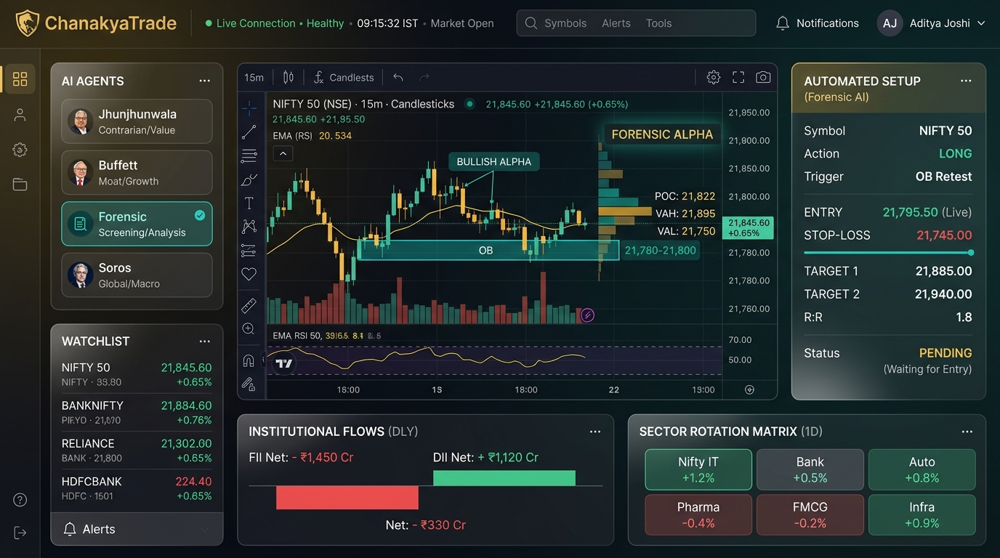
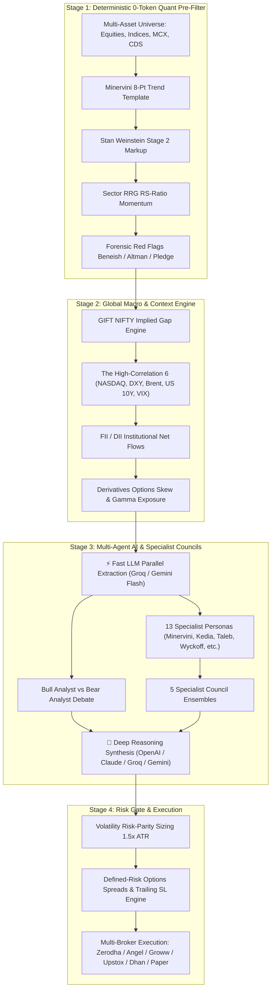

<div align="center">

# 🏛️ ChanakyaTrade
### Institutional-Grade AI Quant Terminal & Multi-Agent Intelligence for Indian Markets
**NSE • BSE • NFO • MCX • CDS**

[](https://github.com/brij-home/chanakya-trade/actions/workflows/ci.yml)
[](https://www.python.org/downloads/)
[](https://fastapi.tiangolo.com)
[](https://react.dev)
[](LICENSE)
[](tests/)

<br />

<p align="center">
  
</p>

*Institutional Quantitative Screening • Global Macro Transmission • Smart Money Concepts (SMC) • 13 Specialist Personas • 5 Council Ensembles • 3-Axis Magic Trend • Portfolio Doctor • Defined-Risk Options • Retail Loss-Streak Shield*

</div>

---

## 📖 Table of Contents
- [🌟 Platform Overview](#-platform-overview)
- [🌐 9-Workspace Navigational Architecture](#-9-workspace-navigational-architecture)
- [🌍 Global Macro Transmission & The High-Correlation 6](#-global-macro-transmission--the-high-correlation-6)
- [🧠 Multi-Agent Intelligence & The 13 Specialist Personas](#-multi-agent-intelligence--the-13-specialist-personas)
- [🏛️ High-Conviction Council Ensembles](#️-high-conviction-council-ensembles)
- [💎 3-Axis Magic Trend & Super-Investor Thematic Baskets](#-3-axis-magic-trend--super-investor-thematic-baskets)
- [🩺 Broker Portfolio AI Doctor & Wealth Optimizer](#-broker-portfolio-ai-doctor--wealth-optimizer)
- [🛡️ Defined-Risk Options & Retail Protection Shield](#️-defined-risk-options--retail-protection-shield)
- [⚡ Complete Quant & Technical Capabilities](#-complete-quant--technical-capabilities)
- [🕹️ Command & Skill Quick Reference](#️-command--skill-quick-reference)
- [🚀 Quickstart & Installation](#-quickstart--installation)
- [🔌 Broker Connectivity & Safety Defaults](#-broker-connectivity--safety-defaults)
- [🧪 Tiered Validation & Verification](#-tiered-validation--verification)
- [📄 License & Disclaimer](#-license--disclaimer)

---

## 🌟 Platform Overview

**ChanakyaTrade** is an institutional-grade strategic quant terminal designed specifically for Indian capital markets (**NSE, BSE, NFO, MCX, CDS**). By unifying **deterministic quantitative pre-filtering (0-token cost)**, **Global Macro transmission**, **Smart Money Concepts (SMC)**, **Volume Price Analysis (VPA)**, **Dual-LLM AI Multi-Agent Debates**, and **13 Specialist Personas**, ChanakyaTrade synthesizes raw market noise into high-conviction, risk-calibrated trade setups with mathematically verified entries, invalidation stop-losses, and structured targets.



---

## 🌐 9-Workspace Navigational Architecture

ChanakyaTrade features a keyboard-indexed **48px Persistent ActivityBar Rail** for instantaneous workspace switching:

| Shortcut | Workspace | Core Capabilities & Views |
| :---: | :--- | :--- |
| `^1` | **Strategic Quant Terminal** | 4-column layout with Symbol header, Lightweight Charts, Volume Profile, and Trade Desk Rail. |
| `^2` | **Multi-Agent Debate Arena** | 4-stage pipeline stepper + 13-member 3D flippable council cards with live adversarial turns. |
| `^3` | **Options & GEX Desk** | Bloomberg-style options chain, Gamma Exposure (GEX) flips, and multi-leg Payoff Simulator. |
| `^4` | **AI Copilot** | Progressive typing wave + chronological date-grouped chat sessions with tool auto-execution. |
| `^5` | **Market Overview** | India VIX gauge, Global Macro Transmission cards, Sector RRG mini-map, and FII/DII tracker. |
| `^6` | **Portfolio Doctor Pro** | Stage 4 dead-money detection, HHI concentration audits, and tax-loss harvesting optimizer. |
| `^7` | **Alerts Manager** | Real-time price threshold and technical indicator condition monitor with Telegram alerts. |
| `^8` | **Trade Journal** | GitHub-style Win/Loss Calendar Heatmap + realized P&L statistics and execution ledger. |
| `^9` | **Backtest Studio** | Interactive equity progression vs NIFTY 50 benchmark + trade drawdown diagnostics. |

---

## 🌍 Global Macro Transmission & The High-Correlation 6

Indian markets do not operate in a vacuum. ChanakyaTrade models global macro transmission into domestic sector indices and single stocks in real time:

```
┌──────────────────────────────────────────────────────────────────────────────────────────┐
│                             🌍 THE HIGH-CORRELATION 6 ENGINE                             │
├─────────────────────┬──────────────┬─────────────────────────────────────────────────────┤
│ Global Macro Asset  │ Correlation  │ Domestic Sector & Stock Transmission                │
├─────────────────────┼──────────────┼─────────────────────────────────────────────────────┤
│ 🇮🇳 GIFT NIFTY       │ ~0.96        │ Computes implied NIFTY opening gap (% and pts)      │
│ 🇺🇸 NASDAQ 100 / S&P │ ~0.82        │ Indian IT Services (TCS, INFY, HCLTECH, COFORGE)    │
│ 💵 DXY & USD/INR    │ -0.74        │ FII Foreign Inflows & Indian Rupee purchasing power │
│ 🛢️ Brent Crude Oil  │ Bipolar      │ Bearish (-0.78): Paints, Aviation, Tyres, OMCs      │
│                     │              │ Bullish (+0.82): ONGC, OIL, Upstream Exploration   │
│ 📈 US 10Y Yield     │ -0.70        │ Multiple compression on high-PE growth stocks       │
│ ⚡ US VIX vs IN VIX │ Contagion    │ Global volatility contagion & options writing risk  │
└─────────────────────┴──────────────┴─────────────────────────────────────────────────────┘
```

---

## 🧠 Multi-Agent Intelligence & The 13 Specialist Personas

ChanakyaTrade embeds **13 authentic, battle-tested market minds** across technical momentum, structural value, price action, quantitative statistics, macro liquidity, and forensic accounting:

| Persona | Master Mind / Framework | Authentic Methodology | Primary Domain | Horizon |
|:---|:---|:---|:---|:---|
| 🚀 **`minervini`** | **Mark Minervini** | SEPA®, 8-Point Trend Template, Stage 2 Markup, Volatility Contraction Pattern (VCP) | Momentum Breakouts | 1–4 Weeks |
| 💎 **`kedia`** | **Vijay Kedia** | SMILE Framework (Smallcap, Medium mgmt, Increasing interest, Large TAM, 5Y Earnings) | Indian Multibaggers | 6–24 Months |
| 🛡️ **`taleb`** | **Nassim Nicholas Taleb** | Antifragile Positive Convexity, Tail-Risk Asymmetry, Zero Naked Gamma, Defined-Risk Spreads | Options & Tail Risk | 1–2 Expiries |
| 📈 **`wyckoff`** | **Richard Wyckoff** | Volume Spread Analysis (VSA), Phase C Spring / Shakeouts, Sign of Strength (SOS), Absorption | Institutional Price Action | 2–6 Weeks |
| ⚡ **`oneil`** | **William O'Neil** | CAN SLIM®, Accelerating EPS (>25% YoY), Leading Industry Groups, Institutional Sponsorship | Growth & Momentum | 3–8 Weeks |
| 🧮 **`simons`** | **Jim Simons** | Mathematical Expected Value ($EV > 1.8R$), Mean Reversion $Z$-Scores, Volatility Regimes | Statistical Arbitrage | 1–5 Days |
| 🎯 **`smc`** | **Smart Money (ICT)** | Asian/London Liquidity Sweeps, Unmitigated Order Blocks (OB), Fair Value Gaps (FVG), CHoCH/MSS | Precision Price Delivery | 1–3 Sessions |
| 🔬 **`forensic`** | **Forensic Auditor** | Beneish M-Score ($< -1.78$), Altman Z''-Score ($> 2.60$), Promoter Pledging ($< 5\%$), Accruals Quality | Governance & Safety | Fundamental Gate |
| 🏰 **`buffett`** | **Warren Buffett** | Durable Economic Moats, High ROIC ($> 18\%$), Pricing Power, Free Cash Flow Conversion | Long-term Compounding | 3–5+ Years |
| 🧠 **`munger`** | **Charlie Munger** | Inversion Mental Models ("Avoid Stupidity"), Zero Dangerous Leverage, Lollapalooza Compounding | Quality & Sanity | 3–5+ Years |
| 🐂 **`jhunjhunwala`**| **Rakesh Jhunjhunwala**| India Secular Demographic Supercycle, Domestic TAM Expansion, Multi-Year CAPEX Cycle | Megatrend Growth | 1–3 Years |
| 🛒 **`lynch`** | **Peter Lynch** | Growth At a Reasonable Price (GARP), PEG Ratio ($< 1.0$), Ground-Level Consumer Demand | Fast-Growing Stalwarts| 6–18 Months |
| 🌊 **`soros`** | **George Soros** | Global Macro Reflexivity, Positive Feedback Loops, RBI Liquidity & FII/DII Capital Inflows | Macro Regimes | 1–3 Months |

---

## 🏛️ High-Conviction Council Ensembles

To eliminate cognitive bias and false positives, ChanakyaTrade groups complementary specialist minds into **Council Ensembles** that produce weighted conviction scores (0–100) and actionable consensus tickets:

```
┌──────────────────────────────────────────────────────────────────────────────────────────┐
│                                🏛️ SPECIALIST COUNCIL ENSEMBLES                            │
├─────────────────────┬─────────────────────────────────────────────────┬──────────────────┤
│ Council Preset      │ Polled Specialist Minds                         │ Strategic Focus  │
├─────────────────────┼─────────────────────────────────────────────────┼──────────────────┤
│ 🚀 Breakout         │ Minervini + Wyckoff + O'Neil + Forensic Auditor │ High-Momentum    │
│ 🎯 Options Sniper   │ Smart Money (SMC) + Taleb + Simons              │ Defined-Risk F&O │
│ 💎 Multibagger Hub  │ Kedia + Buffett + Munger + Jhunjhunwala + Audit │ 10x Compounders  │
│ 🌐 Macro Regime     │ Soros + Jhunjhunwala + Simons + Forensic Audit  │ Flow & Liquidity │
│ 🏰 Core Value Moat  │ Buffett + Munger + Lynch + Forensic Auditor     │ Moat Compounding │
└─────────────────────┴─────────────────────────────────────────────────┴──────────────────┘
```

---

## 💎 3-Axis Magic Trend & Super-Investor Thematic Baskets

The **3-Axis (X, Y, Z) Magic Trend Engine** quantifies fundamental quality, growth migration, and market timing into a unified 0–100 composite score:

- **Axis X: Quality of Business (35 Pts)**: Economic moat, ROCE $\ge 18\%$, Beneish M-Score $< -1.78$, Altman Z'' $> 2.60$, Promoter pledge $< 5\%$, CFO/PAT $\ge 0.8$.
- **Axis Y: Growth & Value Migration (35 Pts)**: Consecutive quarterly sales & PAT growth $\ge 25\%$, high retained earnings reinvestment rate, operating leverage.
- **Axis Z: Value & Timing / Structure (30 Pts)**: Stan Weinstein Stage 2 markup, Minervini 8/8 Trend Template, VCP pivot tightness, RS Rating $\ge 80$, PEG $< 1.5$.

### Curated Thematic Baskets
- 💎 **Christopher Mayer 100-Baggers**: Smallcap base with high ROCE (>20%) and long growth runway.
- 🚀 **Peter Lynch Fast-Growers**: High-growth stalwarts with PEG < 1.0 and earnings acceleration.
- 🏗️ **Mega Order-Book Titans**: Defense, railway, and capex leaders with Order Book / Market Cap $\ge 1.5\text{x}$.
- 📈 **William O'Neil CAN SLIM Leaders**: Breakouts to 52-week new highs backed by institutional volume surges.
- 🏰 **Buffett-Munger Moat Compounders**: Durable competitive advantages with high ROIC and pricing power.
- 🔬 **High-RoCE Microcaps**: NIFTY Microcap 250 compounders with low debt and expanding margins.

---

## 🩺 Broker Portfolio AI Doctor & Wealth Optimizer

Connect your active broker account to run comprehensive institutional diagnostics:

1. **Stan Weinstein Stage 4 Dead-Money Detection**: Flags capital trapped in markdown phases below declining 50/200 SMAs and quantifies opportunity cost vs Stage 2 leaders.
2. **Herfindahl-Hirschman Index (HHI)**: Mathematical evaluation of single-stock and single-sector concentration risk.
3. **Sector Rotation & RRG Alignment**: Audits holding allocations against JdK RRG Leading vs Lagging quadrants.
4. **Post-Budget Tax-Loss Harvesting**: Identifies underwater holdings to offset FY24-25 STCG (20%) and LTCG (12.5%) before financial year-end.
5. **1-Click Pragmatic Rebalancing**: Actionable, risk-calibrated switches ("Trim 5% from Stage 4 XYZ $\rightarrow$ Reallocate to Stage 2 Leading ABC").

---

## 🛡️ Defined-Risk Options & Retail Protection Shield

1. **Strictly Defined-Risk Strategies**:
   - **Bull Call Spreads / Bear Put Spreads**: Capped maximum loss, defined risk-reward ($1:2.0+$), and eliminated Theta bleed.
   - **Delta-Neutral Iron Condors & Ratio Spreads**: Non-directional income structures with structural tail-risk protection.
2. **Behavioral Risk Advisory & Mindful Friction (Co-Pilot, Not Police)**:
   - Detects consecutive loss streaks ($\ge 3$), anti-pyramiding into losing positions, and emotional tilt re-entries.
   - Presents probabilistic psychological context with coaching alternatives and explicit **Double Confirmation** rather than rigid blocking.
3. **Post-Budget FY24-25 Tax & Cost Optimization**:
   - Accurate calculation of updated **STCG (20%)**, **LTCG (12.5%)**, STT turnover charges, GST, and SEBI turnover levies.

---

## ⚡ Complete Quant & Technical Capabilities

- **Smart Money Concepts (SMC)**: Fractal Swings, Change of Character (`CHoCH`), Market Structure Shift (`MSS`), Break of Structure (`BOS`), unmitigated Supply & Demand Order Blocks (OB), and Fair Value Gaps (FVG).
- **Volume Price Analysis (VPA)**: Relative Volume (`RVOL` 20D/50D), Wyckoff Volume Spread Analysis (Stopping Volume, Effort vs Result), Point of Control (`POC`), Value Area High (`VAH`), and Value Area Low (`VAL`).
- **Relative Rotation Graphs (RRG)**: JdK RS-Ratio (trend) and RS-Momentum (velocity) classifying Indian sectors into `LEADING`, `WEAKENING`, `LAGGING`, and `IMPROVING`.
- **Volatility Risk-Parity Position Sizing**: Automatic lot quantization for Indian index & stock futures and options based on $1.5 \times \text{ATR}$ capital risk budgets and Half-Kelly growth sizing.
- **Active Trailing Stop Engine**: Real-time $R$-multiple monitoring, $2R$ Breakeven scale-out (+0.2% cost buffer), `CHANDELIER_ATR_TRAIL` ($3.0 \times \text{ATR}$), and daily 20-EMA trailing rules.

---

## 🕹️ Command & Skill Quick Reference

Access all capabilities instantly via the **Interactive Terminal REPL**, **Web Input Bar**, or **`Ctrl+K` Command Palette**:

### 🏛️ Council & Specialist Personas
```bash
council breakout RELIANCE       # Poll Breakout Council (Minervini + Wyckoff + O'Neil + Audit)
council options_sniper NIFTY    # Poll Options Sniper Council (SMC + Taleb + Simons)
council multibagger TATAMOTORS  # Poll Multibagger Council (Kedia + Buffett + Munger + Jhunjhunwala)
council macro_regime HDFCBANK   # Poll Macro Regime Council (Soros + Jhunjhunwala + Simons)
persona minervini INFY          # Consult Mark Minervini (SEPA, 8-Point Trend Template, VCP)
persona kedia POLYCAB           # Consult Vijay Kedia (SMILE Framework for Indian Multibaggers)
persona taleb NIFTY             # Consult Nassim Taleb (Antifragile Convexity & Spreads)
persona wyckoff RELIANCE        # Consult Richard Wyckoff (VSA Accumulation Springs & SOS)
persona smc BANKNIFTY           # Consult Smart Money Concepts (Liquidity Sweeps & Order Blocks)
```

### 📊 Technical, Fundamental & Thematic Analysis
```bash
structure INFY                  # Run full Smart Money Concepts (SMC) & Order Block scan
multibagger TRENT               # Scan Minervini 8-point trend template & Stage 2 markup
magictrend DIXON                # Run 3-Axis (X, Y, Z) Super-Investor scoring
macro                           # High-Correlation 6 Global Macro Transmission report
baskets                         # List and scan institutional thematic investment baskets
doctor                          # Full AI Health Diagnosis on connected broker portfolio
forensic RELIANCE               # Audit Beneish M-Score, Altman Z-Score & promoter pledging
rrg                             # Render 2D Relative Rotation Graph for all NSE sectors
size NIFTY 24150 23800          # Calculate volatility risk-parity lot size & Half-Kelly sizing
lifecycle INFY 1800 1740        # Track active position trailing stop & 2R breakeven rule
radar                           # Top 10 High-Conviction Opportunity Radar across NSE universe
```

### 🛡️ Options, Risk Shield & Export
```bash
spreads NIFTY BULL_CALL_SPREAD  # Build defined-risk multi-leg options spread
gex NIFTY                       # Gamma Exposure (GEX) profile & zero-gamma flip points
iv-smile NIFTY                  # Real-time implied volatility skew smile curve
tax 50000 90                    # Estimate FY24-25 STCG/LTCG capital gains tax
harvest                         # Scan portfolio for tax-loss harvesting candidates
tilt                            # Check behavioral coaching advisory & loss streak shield
export-pdf                      # Export analysis report as clean PDF
explain                         # Translate quant jargon into plain English
```

---

## 🚀 Quickstart & Installation

### 1. Prerequisites
- **Python 3.11** or higher
- **Node.js 18+** (for desktop web terminal)
- **Git**

### 2. Clone & Setup Environment
```bash
# Clone the repository
git clone https://github.com/brij-home/chanakya-trade.git
cd chanakya-trade

# Create/repair the virtual environment and install dependencies
# Windows PowerShell:
.\scripts\bootstrap.ps1
# macOS / Linux:
bash scripts/bootstrap.sh

# The bootstrap is safe to rerun. It detects a venv whose original Python was
# removed, preserves it as .venv.broken-<timestamp>, and recreates .venv.
# Google Vertex AI is optional; the normal Gemini API needs no GCP setup.
# Install it only when required: .venv\Scripts\python.exe -m pip install -e ".[vertex]"
```

### 3. Configure Credentials (Optional)
```bash
cp .env.example .env
```
*(ChanakyaTrade includes deterministic quantitative fallbacks and operates immediately out-of-the-box in demo/paper mode even without live broker API keys).*

### 4. Launch Options

#### ⚡ Option A: Full Desktop Web Terminal (Recommended)
Start the FastAPI backend (`http://127.0.0.1:8765`) and Vite Web GUI with automated preflight checks:
```powershell
# On Windows PowerShell:
.\scripts\dev.ps1

# On macOS / Linux:
./scripts/dev.sh
```

#### 🕹️ Option B: Interactive Terminal CLI
```bash
python -m app.main --no-broker
```

#### 🖥️ Option C: Terminal Split-Panel TUI
```bash
python -m app.main --tui
```

---

## 🔌 Broker Connectivity & Safety Defaults

- **Safety First (`TRADING_MODE=PAPER`)**: By default, all orders, test suites, and backtesting run in simulated paper mode with realistic execution slippage and SEBI/STT statutory levies.
- **Fail-Closed Live Execution Pipeline** ([`engine/order_lifecycle.py`](file:///c:/Users/brije/.gemini/antigravity/scratch/chanakya-trade/engine/order_lifecycle.py)):
  - Live execution in `EXECUTE` mode is strictly gated behind `ALLOW_LIVE_TRADING=1` and `assert_live_execution_allowed()`.
  - All orders MUST pass through `validate_pretrade()` before reaching broker adapters.
  - Live order requests transition to `SUBMITTING` in the internal ledger before placement. Ambiguous responses or network timeouts transition fail-closed to `UNKNOWN_FREEZE` with zero fabricated IDs.
  - Paper mode exceptions produce `REJECTED` status with explicit error context rather than fabricated fills.
- **Canonical Mode Normalization** (`GET /api/mode` in [`web/api.py`](file:///c:/Users/brije/.gemini/antigravity/scratch/chanakya-trade/web/api.py)):
  - Centralized server-authoritative translation: `OBSERVE → DEMO`, `SIMULATE → PAPER`, `EXECUTE → LIVE`. Prevents execution mode from ever silently displaying as paper trading.
- **Truthful Decision Dossiers** ([`engine/security_360.py`](file:///c:/Users/brije/.gemini/antigravity/scratch/chanakya-trade/engine/security_360.py)):
  - Multi-dimensional equity intelligence returns transparent `UNAVAILABLE` and `PARTIAL` states when live data or valuation metrics are absent, completely eliminating hardcoded price fallbacks, fake DCF targets, or synthetic bull-case biases.
- **Auditable Reconciliation Engine** (`GET /api/reconciliation` in [`web/api.py`](file:///c:/Users/brije/.gemini/antigravity/scratch/chanakya-trade/web/api.py)):
  - Audits the selected execution broker against locally persisted fills and a user-declared opening-cash baseline. It returns `UNAVAILABLE` until both independent sides exist—never compares a broker response to itself—and supplies `broker_account_id`, `broker_snapshot_at`, and `correlation_id`.
- **EOD-First Pilot Workflow**:
  - Daily OHLCV is stored as a versioned local SQLite snapshot with a content checksum. Backtests can replay a fixed `as_of` snapshot and never inject a current tick unless live-candle enrichment is explicitly requested.
  - Every quote carries provider, source (`STREAM` / `REST` / `FALLBACK`), local receipt time and honest data state (`LIVE` / `DELAYED` / `EOD` / `DEGRADED` / `UNAVAILABLE`).
- **Personal Pilot Guardrails**:
  - Default `.env` settings keep execution locked. If live use is deliberately enabled later, it remains restricted to small cash-equity delivery orders (`CNC`), a configurable per-order cap, fresh live data, explicit order confirmation, and the selected execution broker.
  - F&O execution stays blocked until the broker provides and stores verified contract token, lot size and tick size; no static lot-size table is trusted for live orders.
- **Dual-Broker Separation**:
  - **Data Feeds**: Free live ticks & options chains via **Fyers API v3** or **Shoonya/Finvasia Noren** (optional account credentials).
  - **Execution**: Seamless order routing via **Zerodha Kite Connect**, **Angel One SmartAPI**, **Groww**, **Upstox**, **Dhan**, **Shoonya**, **Stoxkart**, or **Mock Broker**.
  - Connecting another broker never changes either role. Select data and execution roles explicitly in the app.
- **SEBI IPv4 Network Binding**: Preserves registered static IPv4 socket overrides for Indian broker order placements.

---

## 🧪 Tiered Validation & Verification

ChanakyaTrade provides a **Tiered Validation Architecture** so you run only what is needed during development:

```powershell
# 1. Repair the environment and run the default fast/unit test tier
.\scripts\test.ps1

# 2. Fast local pre-commit check (< 20s)
# Runs Ruff lint + Format + React Hook AST audit + Vitest + Fast Pytest Smoke Matrix
.venv\Scripts\python.exe scripts/validate_all.py --fast

# 3. Full CI/CD pre-push gate (< 40s)
# Runs all linters + Vitest + Web Bundle Build + Full 2,188+ Pytest Matrix with 4 parallel workers
.venv\Scripts\python.exe scripts/validate_all.py --full

# 4. New Execution & Truthfulness Regression Suites
.venv\Scripts\python.exe -m pytest tests/test_live_oms_p3b.py tests/test_mode_banner_mapping.py tests/test_security_360_unavailable.py tests/test_reconciliation_unavailable.py -v

# 5. Daily / Nightly deep regression & simulation runner
# Runs full test suite + 500-iteration Monte Carlo & options stress tests + Live network integration
.venv\Scripts\python.exe scripts/validate_daily.py

# 6. Universal environment & process cleanup
# Kills orphaned worker processes, frees port 8765, removes temp sqlite databases
.venv\Scripts\python.exe scripts/cleanup.py

# 7. Auto-fix Python lint & formatting errors
.venv\Scripts\python.exe scripts/validate_all.py --fix
```

---

## 📄 License & Disclaimer

- **License**: Released under the **[MIT License](LICENSE)**.
- **Disclaimer**: *ChanakyaTrade is an educational and quantitative intelligence research platform. Trading in financial instruments, equities, futures, and options involves substantial risk of capital loss. Nothing in this platform constitutes registered SEBI investment advice. Always evaluate personal risk tolerance and consult a certified financial advisor before executing live trades.*

<div align="center">
  <sub>Built with institutional rigor for Indian Capital Markets • Copyright (c) 2025–2026 Brijendra Agarwal</sub>
</div>
