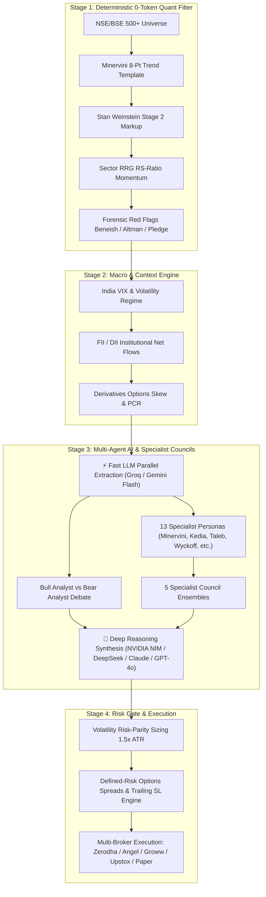
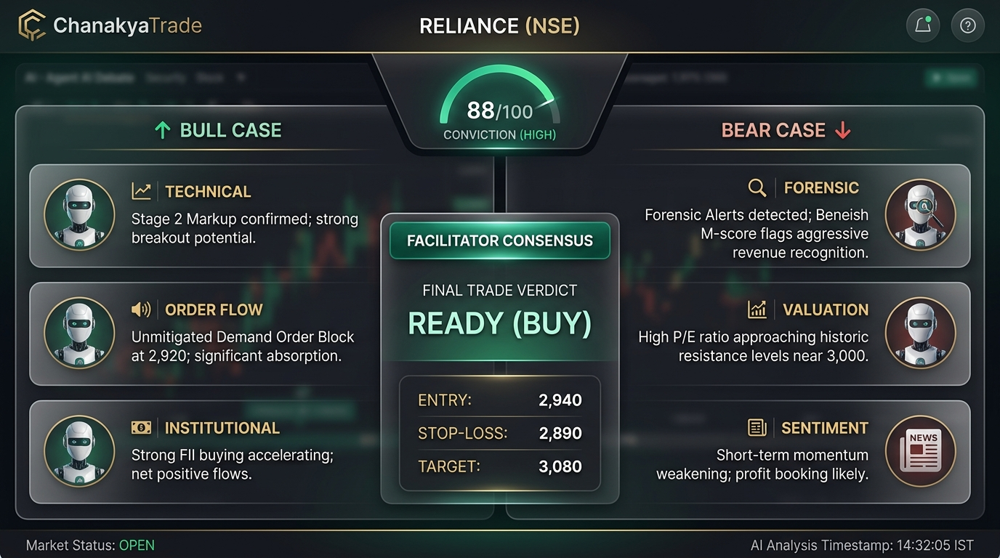
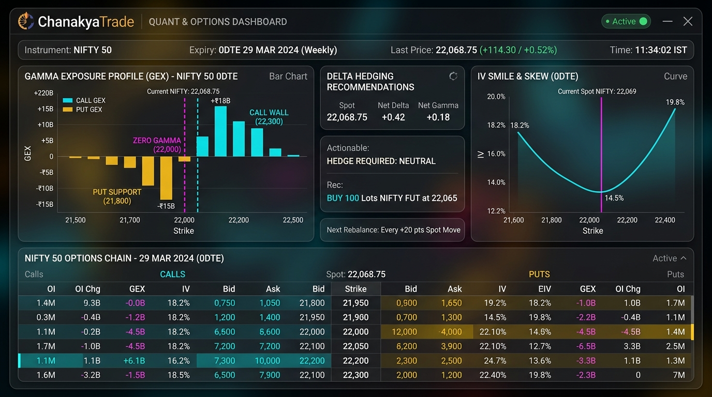

<div align="center">

# 🏛️ ChanakyaTrade
### Institutional-Grade AI Quant Terminal & Multi-Agent Intelligence for Indian Markets
**NSE • BSE • NFO • MCX**

[](https://github.com/brij-home/chanakya-trade/actions/workflows/ci.yml)
[](https://www.python.org/downloads/)
[](https://fastapi.tiangolo.com)
[](https://react.dev)
[](LICENSE)
[](tests/)

<br />

<p align="center">
  
</p>

*Institutional Quantitative Screening • Smart Money Concepts (SMC) • 13 Specialist Personas • 5 Council Ensembles • Defined-Risk Options • Retail Loss-Streak Shield*

</div>

---

## 📖 Table of Contents
- [🌟 Platform Overview](#-platform-overview)
- [📸 Visual Workspaces & Previews](#-visual-workspaces--previews)
- [🧠 Multi-Agent Architecture & The 13 Specialist Personas](#-multi-agent-architecture--the-13-specialist-personas)
- [🏛️ High-Conviction Council Ensembles](#️-high-conviction-council-ensembles)
- [🛡️ Defined-Risk Options & Retail Protection Shield](#️-defined-risk-options--retail-protection-shield)
- [⚡ Complete Quant & Technical Capabilities](#-complete-quant--technical-capabilities)
- [🕹️ Command & Skill Quick Reference](#️-command--skill-quick-reference)
- [🚀 Quickstart & Installation](#-quickstart--installation)
- [🔌 Broker Connectivity & Safety Defaults](#-broker-connectivity--safety-defaults)
- [🧪 Testing & Verification](#-testing--verification)
- [📄 License & Disclaimer](#-license--disclaimer)

---

## 🌟 Platform Overview

**ChanakyaTrade** is an institutional-grade strategic quant terminal designed specifically for Indian markets. By unifying **deterministic quantitative pre-filtering (0-token cost)**, **Smart Money Concepts (SMC)**, **Volume Price Analysis (VPA)**, **Dual-LLM AI Multi-Agent Debates**, and **Specialist Personas**, ChanakyaTrade synthesizes raw market noise into high-conviction, risk-calibrated trade setups with mathematically verified entries, invalidation stop-losses, and structured targets.



---

## 📸 Visual Workspaces & Previews

| 📊 Strategic Quant Terminal | ⚔️ Multi-Agent Debate Arena |
|:---:|:---:|
|  |  |
| *Real-time candlesticks, unmitigated SMC Order Blocks, Volume Profile POC/VAH/VAL, and synchronized 13 Personas Deck.* | *Adversarial Bull vs Bear research, 5 Council Presets, Facilitator consensus, and 1-click order staging.* |

| ⚡ Quant Options & GEX Desk | 🎯 Defined-Risk Spread Simulator |
|:---:|:---:|
|  |  |
| *Gamma Exposure (GEX) flip levels, 0DTE Volatility Skew smile, Delta hedging, and strike-by-strike open interest.* | *Multi-leg options payoff curves, capped risk profiles, zero Theta bleed, and margin requirements.* |

---

## 🧠 Multi-Agent Architecture & The 13 Specialist Personas

ChanakyaTrade embeds **13 authentic, battle-tested market minds** across technical momentum, structural value, price action, quantitative statistics, macro liquidity, and forensic accounting. Every persona supports both **deep AI reasoning** and **deterministic rule-based fallback**:

| Persona | Master Mind / Framework | Authentic Methodology | Primary Domain | Horizon |
|:---|:---|:---|:---|:---|
| 🚀 **`minervini`** | **Mark Minervini** | SEPA®, 8-Point Trend Template, Stage 2 Markup, Volatility Contraction Pattern (VCP) | Momentum Breakouts | 1–4 Weeks |
| 💎 **`kedia`** | **Vijay Kedia** | SMILE Framework (Smallcap, Medium mgmt, Increasing interest, Large TAM, 5Y Earnings) | Indian Multibaggers | 6–24 Months |
| 🛡️ **`taleb`** | **Nassim Nicholas Taleb** | Antifragile Positive Convexity, Tail-Risk Asymmetry, Zero Naked Gamma, Defined-Risk Spreads | Options & Tail Risk | 1–2 Expiries |
| 📈 **`wyckoff`** | **Richard Wyckoff** | Volume Spread Analysis (VSA), Phase C Spring / Shakeouts, Sign of Strength (SOS), Absorption | Institutional Price Action | 2–6 Weeks |
| ⚡ **`oneil`** | **William O'Neil** | CAN SLIM®, Accelerating EPS (>25% YoY), Leading Industry Groups, Institutional Sponsorship | Growth & Momentum | 3–8 Weeks |
| 🧮 **`simons`** | **Jim Simons** | Mathematical Expected Value ($EV > 1.8R$), Mean Reversion $Z$-Scores, Volatility Regimes | Statistical Arbitrage | 1–5 Days |
| 🎯 **`smc`** | **Smart Money (ICT)** | Asian/London Liquidity Sweeps, Unmitigated Order Blocks (OB), Fair Value Gaps (FVG), CHoCH/MSS | Precision Price Delivery | 1–3 Sessions |
| 🔬 **`forensic`** | **Forensic Auditor** | Beneish M-Score ($< -1.78$), Altman Z''-Score ($> 2.60$), Promoter Pledging ($< 5\%$), Accruals Quality | Governance & Safety | Fundamental Gate |
| 🏰 **`buffett`** | **Warren Buffett** | Durable Economic Moats, High ROIC ($> 18\%$), Pricing Power, Free Cash Flow Conversion | Long-term Compounding | 3–5+ Years |
| 🧠 **`munger`** | **Charlie Munger** | Inversion Mental Models ("Avoid Stupidity"), Zero Dangerous Leverage, Lollapalooza Compounding | Quality & Sanity | 3–5+ Years |
| 🐂 **`jhunjhunwala`**| **Rakesh Jhunjhunwala**| India Secular Demographic Supercycle, Domestic TAM Expansion, Multi-Year CAPEX Cycle | Megatrend Growth | 1–3 Years |
| 🛒 **`lynch`** | **Peter Lynch** | Growth At a Reasonable Price (GARP), PEG Ratio ($< 1.0$), Ground-Level Consumer Demand | Fast-Growing Stalwarts| 6–18 Months |
| 🌊 **`soros`** | **George Soros** | Global Macro Reflexivity, Positive Feedback Loops, RBI Liquidity & FII/DII Capital Inflows | Macro Regimes | 1–3 Months |

---

## 🏛️ High-Conviction Council Ensembles

To eliminate cognitive bias and false positives, ChanakyaTrade groups complementary specialist minds into **Council Ensembles** that produce weighted conviction scores (0–100) and actionable consensus tickets:

```
┌──────────────────────────────────────────────────────────────────────────────────────────┐
│                                🏛️ SPECIALIST COUNCIL ENSEMBLES                            │
├─────────────────────┬─────────────────────────────────────────────────┬──────────────────┤
│ Council Preset      │ Polled Specialist Minds                         │ Strategic Focus  │
├─────────────────────┼─────────────────────────────────────────────────┼──────────────────┤
│ 🚀 Breakout         │ Minervini + Wyckoff + O'Neil + Forensic Auditor │ High-Momentum    │
│ 🎯 Options Sniper   │ Smart Money (SMC) + Taleb + Simons              │ Defined-Risk F&O │
│ 💎 Multibagger Hub  │ Kedia + Buffett + Munger + Jhunjhunwala + Audit │ 10x Compounders  │
│ 🌐 Macro Regime     │ Soros + Jhunjhunwala + Simons + Forensic Audit  │ Flow & Liquidity │
│ 🏰 Core Value Moat  │ Buffett + Munger + Lynch + Forensic Auditor     │ Moat Compounding │
└─────────────────────┴─────────────────────────────────────────────────┴──────────────────┘
```

---

## 🛡️ Defined-Risk Options & Retail Protection Shield

1. **Strictly Defined-Risk Strategies**:
   - **Bull Call Spreads / Bear Put Spreads**: Capped maximum loss, defined risk-reward ($1:2.0+$), and eliminated Theta bleed.
   - **Delta-Neutral Iron Condors & Ratio Spreads**: Non-directional income structures with structural tail-risk protection.
2. **Behavioral Risk Advisory & Mindful Friction (Co-Pilot, Not Police)**:
   - Detects consecutive loss streaks ($\ge 3$), anti-pyramiding into losing positions, and emotional tilt re-entries.
   - Presents probabilistic psychological context with coaching alternatives and explicit **Double Confirmation** rather than rigid blocking.
3. **Post-Budget FY24-25 Tax & Cost Optimization**:
   - Accurate calculation of updated **STCG (20%)**, **LTCG (12.5%)**, STT turnover charges, GST, and SEBI turnover levies.
   - 1-click **Tax-Loss Harvesting Scanner** (`harvest`) identifying loss positions to offset taxable short-term gains before financial year-end.

---

## ⚡ Complete Quant & Technical Capabilities

- **Smart Money Concepts (SMC)**: Fractal Swings, Change of Character (`CHoCH`), Market Structure Shift (`MSS`), Break of Structure (`BOS`), unmitigated Supply & Demand Order Blocks (OB), and Fair Value Gaps (FVG).
- **Volume Price Analysis (VPA)**: Relative Volume (`RVOL` 20D/50D), Wyckoff Volume Spread Analysis (Stopping Volume, Effort vs Result), Point of Control (`POC`), Value Area High (`VAH`), and Value Area Low (`VAL`).
- **Relative Rotation Graphs (RRG)**: JdK RS-Ratio (trend) and RS-Momentum (velocity) classifying Indian sectors into `LEADING`, `WEAKENING`, `LAGGING`, and `IMPROVING`.
- **Volatility Risk-Parity Position Sizing**: Automatic lot quantization for Indian index & stock futures and options based on $1.5 \times \text{ATR}$ capital risk budgets and Half-Kelly growth sizing.
- **Active Trailing Stop Engine**: Real-time $R$-multiple monitoring, $2R$ Breakeven scale-out (+0.2% cost buffer), `CHANDELIER_ATR_TRAIL` ($3.0 \times \text{ATR}$), and daily 20-EMA trailing rules.

---

## 🕹️ Command & Skill Quick Reference

ChanakyaTrade provides instant access via the **Interactive Terminal REPL**, **Web Input Bar**, and **`Ctrl+K` Command Palette**:

### 🏛️ Council & Specialist Personas
```bash
council breakout RELIANCE       # Poll Breakout Council (Minervini + Wyckoff + O'Neil + Audit)
council options_sniper NIFTY    # Poll Options Sniper Council (SMC + Taleb + Simons)
council multibagger TATAMOTORS  # Poll Multibagger Council (Kedia + Buffett + Munger + Jhunjhunwala)
council macro_regime HDFCBANK   # Poll Macro Regime Council (Soros + Jhunjhunwala + Simons)
persona minervini INFY          # Consult Mark Minervini (SEPA, 8-Point Trend Template, VCP)
persona kedia POLYCAB           # Consult Vijay Kedia (SMILE Framework for Indian Multibaggers)
persona taleb NIFTY             # Consult Nassim Taleb (Antifragile Convexity & Spreads)
persona wyckoff RELIANCE        # Consult Richard Wyckoff (VSA Accumulation Springs & SOS)
persona smc BANKNIFTY           # Consult Smart Money Concepts (Liquidity Sweeps & Order Blocks)
```

### 📊 Technical & Quantitative Analysis
```bash
structure INFY                  # Run full Smart Money Concepts (SMC) & Order Block scan
multibagger TRENT               # Scan Minervini 8-point trend template & Stage 2 markup
forensic RELIANCE               # Audit Beneish M-Score, Altman Z-Score & promoter pledging
rrg                             # Render 2D Relative Rotation Graph for all NSE sectors
size NIFTY 24150 23800          # Calculate volatility risk-parity lot size & Half-Kelly sizing
lifecycle INFY 1800 1740        # Track active position trailing stop & 2R breakeven rule
radar                           # Top 10 High-Conviction Opportunity Radar across NSE universe
bigmove NIFTY                   # Predict high-probability squeeze expansions
```

### 🛡️ Options & Risk Shield
```bash
spreads NIFTY BULL_CALL_SPREAD  # Build defined-risk multi-leg options spread
gex NIFTY                       # Gamma Exposure (GEX) profile & zero-gamma flip points
iv-smile NIFTY                  # Real-time implied volatility skew smile curve
tax 50000 90                    # Estimate FY24-25 STCG/LTCG capital gains tax
harvest                         # Scan portfolio for tax-loss harvesting candidates
tilt                            # Check behavioral coaching advisory & loss streak shield
```

---

## 🚀 Quickstart & Installation

### 1. Prerequisites
- **Python 3.11** or higher
- **Node.js 18+** (for desktop web terminal)
- **Git**

### 2. Clone & Setup Environment
```bash
# Clone the repository
git clone https://github.com/brij-home/chanakya-trade.git
cd chanakya-trade

# Create and activate virtual environment
python -m venv .venv
# Windows PowerShell:
.venv\Scripts\activate
# macOS / Linux:
source .venv/bin/activate

# Install dependencies in editable mode
pip install -e ".[dev]"
```

### 3. Configure Credentials (Optional)
```bash
cp .env.example .env
```
*(ChanakyaTrade includes deterministic fallbacks and operates immediately out-of-the-box in demo / paper mode even without live broker API keys).*

### 4. Launch Options

#### ⚡ Option A: Full Desktop Web Terminal (Recommended)
Start the FastAPI backend (`http://127.0.0.1:8765`) and Vite Web GUI with automated preflight checks:
```powershell
# On Windows PowerShell:
.\scripts\dev.ps1

# On macOS / Linux:
./scripts/dev.sh
```

#### 🕹️ Option B: Interactive Terminal CLI
```bash
python -m app.main --no-broker
```

#### 🖥️ Option C: Terminal Split-Panel TUI
```bash
python -m app.main --tui
```

---

## 🔌 Broker Connectivity & Safety Defaults

- **Safety First (`TRADING_MODE=PAPER`)**: By default, all orders, test suites, and backtesting run in simulated paper mode with realistic execution slippage and SEBI/STT statutory levies.
- **Dual-Broker Separation**:
  - **Data Feeds**: Free live ticks & options chains via **Fyers API v3**.
  - **Execution**: Seamless order routing via **Zerodha Kite Connect**, **Angel One SmartAPI**, **Groww**, **Upstox**, **Dhan**, or **Mock Broker**.
- **SEBI IPv4 Network Binding**: Preserves registered static IPv4 socket overrides for Indian broker order placements.

---

## 🧪 Testing & Verification

The codebase includes a deterministic test suite containing **2,160+ unit and integration tests** executing in $<90$ seconds without external network dependencies:

```bash
# Run complete test suite with 4 worker threads
.venv\Scripts\pytest.exe -n 4

# Run persona and council test suites
.venv\Scripts\pytest.exe tests/test_personas.py tests/test_persona_debate.py -v
```

---

## 📄 License & Disclaimer

- **License**: Released under the **[MIT License](LICENSE)**.
- **Disclaimer**: *ChanakyaTrade is an educational and quantitative intelligence research platform. Trading in financial instruments, equities, futures, and options involves substantial risk of capital loss. Nothing in this platform constitutes registered SEBI investment advice. Always evaluate personal risk tolerance and consult a certified financial advisor before executing live trades.*

<div align="center">
  <sub>Built with institutional rigor for Indian Capital Markets • Copyright (c) 2025–2026 Brijendra Agarwal</sub>
</div>
